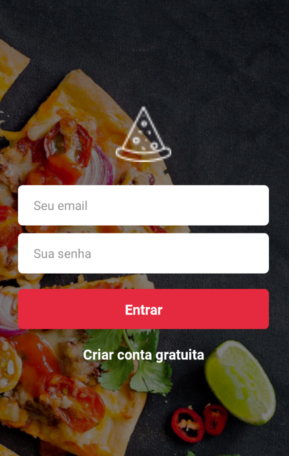

# Desafio Final 2 - APLICATIVO PIZZARIA

Nesse desafio foi construida uma aplicação completa envolvendo back-end com NodeJS, front-end com ReactJS e mobile com React Native.

A aplicação consiste em um app de controle de pedidos por delivery de uma pizzaria. O aplicativo móvel será utilizado pelos clientes da pizzaria para realizar pedidos e a versão web será utilizada para controle e registro dos pedidos realizados.

A aplicação chamada “Pizza Don Juan” será utilizada para realizar e controlar pedidos de delivery. A aplicação não suportará mais restaurantes sendo feita apenas para essa pizzaria.

A aplicação móvel é a parte mais completa do desafio, contendo todas as páginas necessárias para um cliente realizar um pedido na pizzaria, selecionar sabor, tamanho e fechar pedido. O cliente também poderá visualizar seu histórico de pedidos e todo cardápio da pizzaria.

O link para o backend deste aplicativo se encontra aqui:

https://github.com/dbins/rocketseat_desafiofinal2_backend

O link para o frontend deste aplicativo se encontra aqui:

https://github.com/dbins/rocketseat_desafiofinal2_frontend

Neste aplicativo foi utilizado o React Native CLI, estilização através de Styled Components, React Navigation, Redux, Redux Saga e Reactotron. Também foi feita uma splashscreen e um ícone personalizado, além da configuração necessária para gerar um APK assinado.

## Instalação

- git clone https://github.com/dbins/rocketseat_desafiofinal2_mobile
- npm install
- Ative o backend junto com a fila de disparos de e-mails (Redis)
- Edite o arquivo /src/services/api.js e insira o endereço de IP da API
- Edite o arquivo /src/config/ReactotronConfig.js e informe o seu IP local. Essa etapa é opcional, é apenas para quem for testar a aplicação usando o Reactotron.
- Abra o emulador. Os testes foram feitos no Windows 10 utilizando o emulador Genymotion (Android)
- react-native run-android

## Requisitos Funcionais

**Usuário/Autenticação**

- O usuário pode se cadastrar com nome, e-mail e senha;
- O usuário pode realizar login utilizando e-mail e senha;

**Detalhes**

- Ao acessar o aplicativo, existe um cardápio composto pelas categorias de produto (pizza/bebidas/massas), tipo de produtos (sabor de pizza/marca de refrigerante) e tamanho do produto (cm para pizzas/ml para bebidas/P,M ou G para outros);
- Na finalização do pedido, ao informar o CEP, o restante dos campos são preenchidos de forma automática;
- Os administradores não podem logar no aplicativo mobile.
- Existe uma tela onde o usuário pode consultar os pedidos que já foram feitos.

## Gerar APK

Para gerar o APK, a partir do terminal, dentro da pasta do projeto, faça o seguinte:

- cd android
- gradlew assembleDebug (para gerar a versão de testes) ou gradlew assembleRelease (para gerar a versão para enviar para a PlayStore)

## Configuração React Native

### Instalação ESLINT
O ESLint é uma ferramenta de lint plugável para JavaScript e JSX;

npm install eslint --save-dev
npx eslint --init

Instalação dos plugis ESLint

npm install eslint-config-airbnb --save-dev
npm install eslint-plugin-import --save-dev
npm install eslint-plugin-jsx-a11y --save-dev
npm install eslint-plugin-react --save-dev
npm install eslint-plugin-react --save-dev
npm install --save-dev eslint-plugin-import eslint-import-resolver-babel-root-import
npm install babel-plugin-root-import --save-dev (para permitir que os caminhos dos imports e includes sejam relativos a raiz do projeto)

### Instalação Prettier
O Prettier atualiza seu código automaticamente seguindo os padrões que você quiser toda vez salva o arquivo;

npm install --save-dev --save-exact prettier

Instalação integração Prettier x ESLint
npm install --save-dev eslint-plugin-prettier
npm install --save-dev eslint-config-prettier
npm install --save-dev prettier eslint-config-prettier eslint-plugin-prettier

### Editor Config
O EditorConfig é um formatador de arquivos e coleções em forma de Plugin para Editores de código/texto com o objetivo de manter um padrão de código consistente entre diferentes editores, IDE's ou ambientes;

### Configurações

As configurações destes 3 recursos ficam disponíveis na raiz do projeto.

editorconfig - Arquivo destinado à configuração do plugin Editor Config, que padroniza algumas configurações para o editor em diferentes ambientes;

.eslintrc.json - Arquivo de configuração do ESLint, é nele que são inseridas as regras e configurações de Linting do projeto, tal como a configuração do Resolver para o Babel Plugin Root Import e configuração da variável global __DEV__;

babel.config.js - Arquivo de configuração do Babel, é nele que é configurado o Babel Plugin Root Import para aceitar imports absolutos na aplicação usando o diretório src como raiz;

